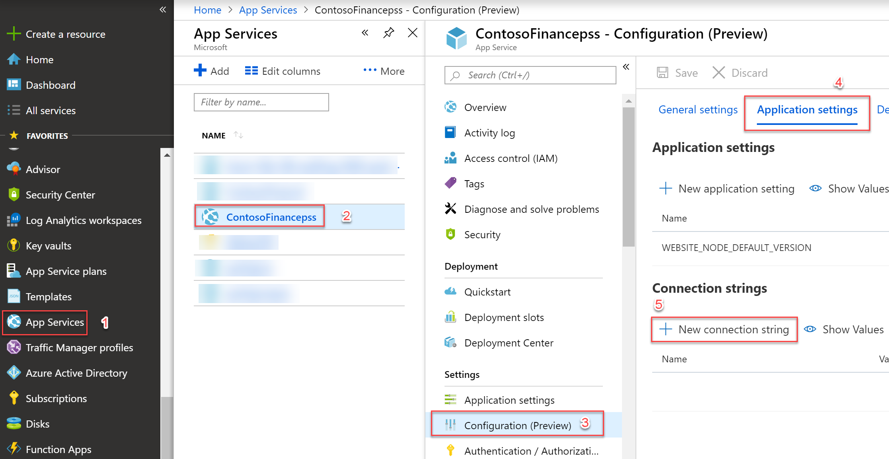
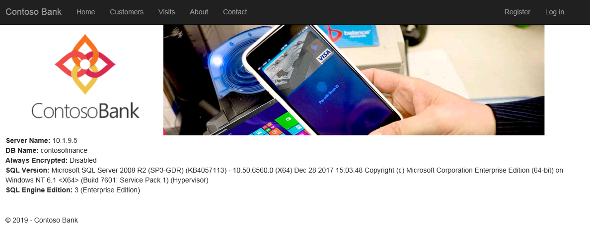
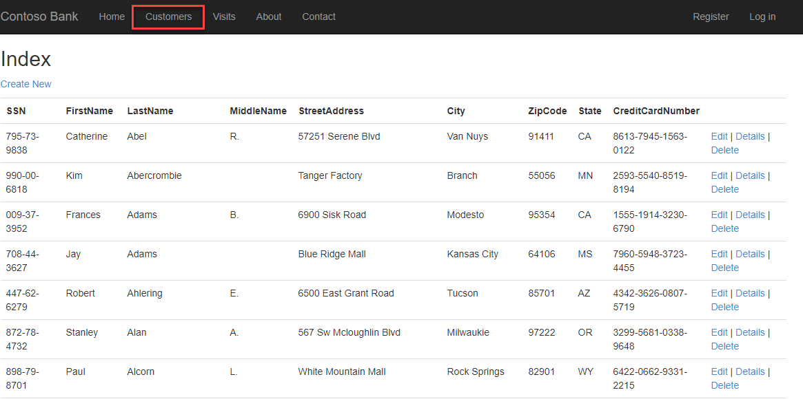
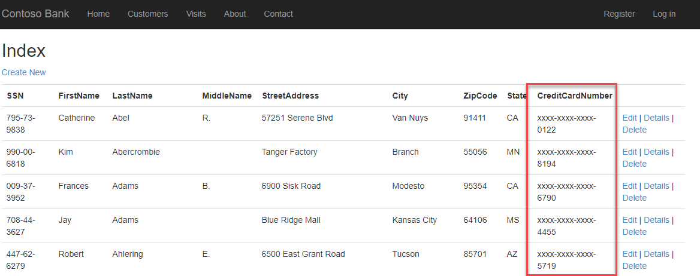
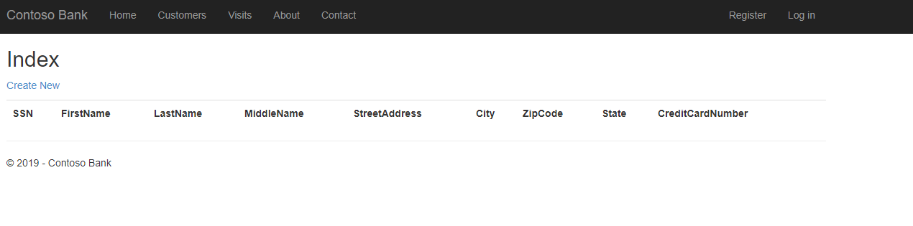
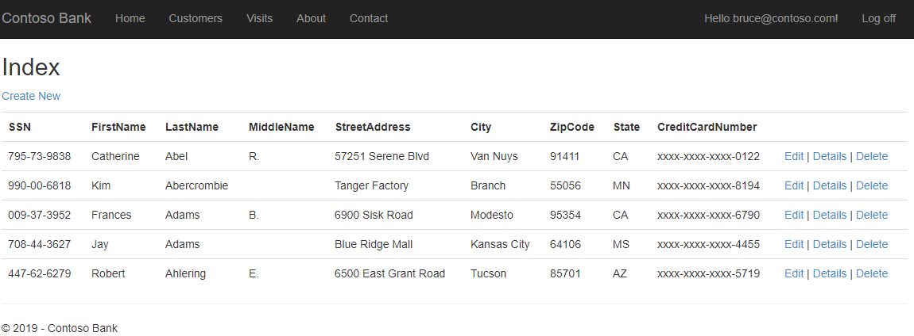

## Task 1: Restore the ContosoFinance Database
Download the database backup from [lab-files](/lab-files/contosofinance.bacpac)
## Task 2: Create a the ContosoFinance Website
With the [Azure CLI](https://docs.microsoft.com/en-us/cli/azure/install-azure-cli?view=azure-cli-latest) installed on your machine, open a PowerShell command prompt and run the following steps:
<BR><b>NOTE: </b>Alternatively you can use [shell.azure.com](https://shell.azure.com) 
   1. `az login` to login to your subscription. You will be prompted for credentials to authenticate to your account via web browser.
    

   2. `az group create --name ue2_sqldbsecurity_rg --location "East US2"`  to create a resource group for all items you will be creating for this lab

### Run the below to deploy the website
   3. `az appservice plan create -g ue2_sqldbsecurity_rg -n ContosoFinance` to create the app service plan

   4. `az webapp create -g ue2_sqldbsecurity_rg -p ContosoFinance -n ContosoFinance[initials]` to create an App Service plan for your web application, replacing the [place_holders] for your resource group and WebApp name. <br>**Note:** Your WebApp name must be universally unique.

   5. `az webapp deployment source config-zip --resource-group ue2_sqldbsecurity_rg --name ContosoFinance[initials] --src [pathtozip]\ContosoFinance.zip` to deploy the ContosoFinance webapp
67. Close the PowerShell command prompt

## Task 3: Configure Connection string for the ContosoFinance site

1. Within the [Azure Portal](https://portal.azure.com) navigate to App Services

2. Open App Services(1)->You Web App deployed in Task 2 (2) ->Configuration (Preview) (3) -> Application Settings (4) -> + New Connection (5)

   

3. Add a New Connection String

   1. Name: `DefaultConnection`
   2. Value: `Data Source=contosofinance.database.windows.net; Initial Catalog=contosofinance; User ID=appuser;Password=P@ssw0rd1234`.
   3. Type: `SQLAzure`

4. Go to the Overview page of the ContosoFinance App Service and click on the URL ex: https://contosofinancepss.azurewebsites.net

5. ContosoFinance website will launch successfully if configuration steps completed successfully, take note of the SQL Version listed. 

   


## (Optional) Exercise 3: Security Features in Azure SQLDB to protect your Data

One of the benefits of moving to Azure SQLDB is to take advantage of the latest engine enhancements. In particular security is of utmost importance to most customers. In this section we will take a look at implementing Dynamic Data Masking and Row Level Security. What is not covered is Always Encrypted due to brevity, but can be enabled following [this blog](https://beanalytics.wordpress.com/2016/09/15/using-sql-always-encrypted-with-azure-web-app-service/).

### Task 1: Enabling Dynamic Data Masking (DDM)

1. Open the Contoso Finance website and browse to the Customers tab. Notice you can see all customers information. We will enable DDM to the AppUser where they can only see the last 4 digits of the SSN number.

   

2. Within the [Azure Portal](https://portal.azure.com) navigate to SQL database and click on the ContosoFinance database

3. Under Security, click Dynamic Data Masking

4. Add a masking Rule for Credit Cards 

   1. Click **+ Add mask**

   2. **Schema:** dbo

   3. **Table:** Customers

   4. **Column:** CreditCardNumber

   5. **Masking field format:** Credit card value

      Click **Add** followed by **Save** on the following screen

5. Refresh your Customers screen for the Contoso Finance website and notice that CreditCardNumber is now masked

   

### Task 2: Enabling Row Level Security (RLS)

In the previous task we looked at obfuscating data, what if you wanted to limit the visibility of data depending on your users. RLS can be implemented to solve for this

1. Open SQL Server Management Studio and connect to the Azure SQL Database with the sqladmin login, run the below script in a new query window to enable RLS

   **NOTE: ENSURE YOU ARE IN THE CONTOSOFINANCE DATABASE**

   ```sql
   DROP SECURITY POLICY IF EXISTS Security.customerSecurityPolicy
   DROP FUNCTION IF EXISTS Security.customerAccessPredicate
   DROP SCHEMA IF EXISTS Security
   go
   
   CREATE SCHEMA Security
   go
   
   -- Create predicate function for RLS. 
   CREATE FUNCTION Security.customerAccessPredicate(@customerID int)
   	RETURNS TABLE
   	WITH SCHEMABINDING
   AS
   	RETURN SELECT 1 AS isAccessible
   	FROM dbo.ApplicationUsercustomers
   	WHERE 
   	(
   		-- application users can access only customers assigned to them
   		customer_customerID = @customerID
   		AND ApplicationUser_Id = CAST(SESSION_CONTEXT(N'UserId') AS nvarchar(128)) 
   	)
   	OR 
   	(
   		-- DBAs can access all customers
   		CAST(SESSION_CONTEXT(N'UserId') AS nvarchar(128)) = '3c13e848-e04e-4eca-af0c-9d4abcb40209' OR IS_MEMBER('db_owner') = 1
   	)
   go
   
   -- Create security policy that adds this function as a security predicate on the customers and Visits tables
   --	Filter predicates filter out customers who shouldn't be accessible by the current user
   --	Block predicates prevent the current user from inserting any customers who aren't mapped to them
   CREATE SECURITY POLICY Security.customerSecurityPolicy
   	ADD FILTER PREDICATE Security.customerAccessPredicate(customerID) ON dbo.customers,
   	ADD BLOCK PREDICATE Security.customerAccessPredicate(customerID) ON dbo.customers,
   	ADD FILTER PREDICATE Security.customerAccessPredicate(customerID) ON dbo.Visits,
   	ADD BLOCK PREDICATE Security.customerAccessPredicate(customerID) ON dbo.Visits
   go
   ```

   

2. Refresh your Customers screen for the Contoso Finance website and notice that you no longer see any data. In order to see data, we need to login to the application and based on your user defines which roles you can see.

   

3. Click on **Log in **in the upper right corner, using the following credentials

   1. **Email:** bruce@contoso.com

   2. **Password:** P@ssw0rd

      click Log in

   

4. Navigate back to the customers page and notice you can now see some of the records
5. Repeat the same steps as 3 & 4 using the following credentials
   1. **Email:** selena@contoso.com
   2. **Password:** P@ssw0rd
6. Notice you now see different records.

## After the hands-on lab 

Duration: 5 Minutes

After successfully completing this lab, to conserve cost, you can remove all resources created by deleting the resource group. If you prefer to retain the artifacts created as part of this lab do not proceed to the next task

### Task 1: Delete resource group

1. Open a PowerShell cmd prompt and run the following

   `az login` when prompted enter your credentiatls

   `az group delete --name ue2_sqldbsecurity_rg `

You should follow all steps provided *after* attending the Hands-on lab.